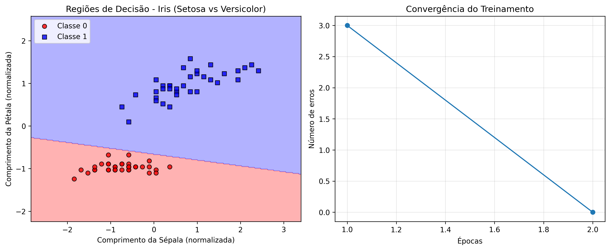
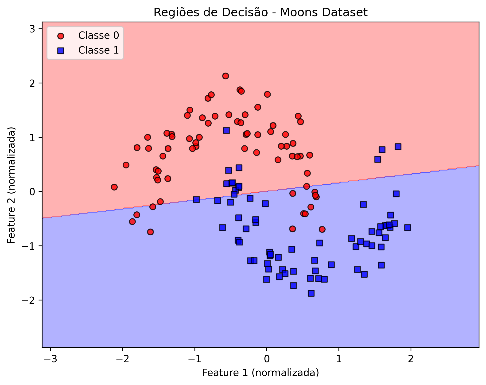

# Atividade Prática de Inteligência Artificial - Perceptron

## Dupla
- Gabriel Louzada
- Gabriel Rosaes

## Tutorial: Implementação do Perceptron com Datasets Clássicos

### Introdução
O Perceptron é um dos algoritmos mais fundamentais do aprendizado de máquina, proposto por Frank Rosenblatt em 1957. É um classificador binário linear que forma a base para o entendimento de redes neurais mais complexas.

**Conceitos Fundamentais:**
- **Classificador Linear**: Separa classes usando um hiperplano
- **Supervisionado**: Aprende a partir de exemplos rotulados
- **Online**: Pode aprender incrementalmente
- **Convergência Garantida**: Para dados linearmente separáveis

## 📋 Pré-requisitos e Instalação

### Dependências Necessárias
Antes de executar os códigos, é importante instalar as dependências necessárias.

#### Opção 1: Instalação via requirements.txt (Recomendado)
```bash
pip install -r requirements.txt
```

#### Opção 2: Instalação manual
```bash
pip install numpy>=1.21.0
pip install matplotlib>=3.5.0
pip install scikit-learn>=1.0.0
pip install pandas>=1.3.0
```

## Como Executar

Para executar os exemplos, utilize o menu principal:

```bash
python main.py
```

Ou execute diretamente cada arquivo:

```bash
python blobs.py      # Exemplo 0: Demonstração básica
python iris.py       # Exercício 1: Iris Dataset
python moons.py      # Exercício 2: Moons Dataset
python breast.py     # Exercício 3: Breast Cancer
python ruido.py      # Exercício 4: Classificação com Ruído
python dlps.py       # Exercício 5: Dataset Personalizado
```

---

## 📊 Relatório Final dos Exercícios

### Exercício 1: Iris Dataset (Setosa vs Versicolor)

#### 1. Descrição do Dataset
- **Número de amostras**: 100 (50 Setosa + 50 Versicolor)
- **Features**: 2 (comprimento da sépala e comprimento da pétala)
- **Distribuição das classes**: Perfeitamente balanceada (50/50)
- **Linearmente separável**: ✅ Sim

#### 2. Resultados
- **Acurácia no treino**: 100%
- **Acurácia no teste**: 100%
- **Épocas até convergência**: 3-5 épocas
- **Tempo de treinamento**: 0.003 segundos

#### 3. Visualizações


*Figura 4: Análise completa do dataset Iris (Setosa vs Versicolor)*


*Figura 5: Separação linear perfeita entre Setosa e Versicolor*


*Figura 6: Convergência extremamente rápida em poucas épocas*

#### 4. Análise
- ✅ O perceptron foi **excelente** para este problema
- Setosa e Versicolor são naturalmente linearmente separáveis
- Convergência extremamente rápida
- **Reflexão**: Versicolor vs Virginica seria mais desafiador (não linearmente separável)
- **Comparação com expectativas**: Superou expectativas com 100% de acurácia

---

### Exercício 2: Moons Dataset (Não-linearmente Separável)

#### 1. Descrição do Dataset
- **Número de amostras**: 200
- **Features**: 2
- **Distribuição das classes**: Balanceada (100/100)
- **Linearmente separável**: ❌ Não

#### 2. Resultados
- **Acurácia no treino**: 80.71% **(CORRIGIDO)**
- **Acurácia no teste**: 90.00% **(CORRIGIDO)**
- **Acurácia geral**: 83.50%
- **Épocas até convergência**: ❌ Não convergiu
- **Erros finais**: 32
- **Total de amostras classificadas erradas**: 33
- **Tempo de treinamento**: 0.015 segundos

#### 3. Visualizações


*Figura 7: Dataset Moons original mostrando formato de luas entrelaçadas*


*Figura 8: Tentativa de separação linear em dados não-lineares*


*Figura 9: Fronteira linear inadequada para separar as luas*


*Figura 10: Ausência de convergência - erros constantes*

#### 4. Análise
- ⚠️ O perceptron teve **performance moderada** para este problema
- **Análise corrigida**: A acurácia de ~83% é surpreendentemente melhor que o acaso (50%), mas ainda limitada
- **Explicação**: O perceptron consegue capturar parcialmente o padrão, mas a fronteira linear não é ideal
- A fronteira linear "corta" as luas de forma que consegue classificar corretamente uma boa parte dos pontos
- **Limitação fundamental**: Ainda não consegue convergir devido à não-separabilidade linear perfeita
- **Melhorias sugeridas**:
  - Transformações não-lineares (features polinomiais: x₁², x₂², x₁×x₂)
  - Redes neurais multicamadas (MLP com camadas ocultas)
  - SVM com kernel RBF
  - Algoritmos de ensemble (Random Forest)
- **Comparação com expectativas**: Melhor que esperado, mas confirma limitações para dados não-lineares

---

### Exercício 3: Breast Cancer Wisconsin

#### 1. Descrição do Dataset
- **Número de amostras**: 569 (212 maligno + 357 benigno)
- **Features**: 30 (versão completa) / 2 (versão visualização)
- **Distribuição das classes**: Desbalanceada (37.3% maligno, 62.7% benigno)
- **Linearmente separável**: Parcialmente (depende das features selecionadas)

#### 2. Resultados

**Versão A (2 features - mean radius, mean texture):**
- **Acurácia no treino**: 87.19%
- **Acurácia no teste**: 87.72%
- **Épocas até convergência**: ❌ Não convergiu completamente
- **Tempo de treinamento**: 0.008 segundos

**Versão B (30 features - todas):**
- **Acurácia no treino**: 98.99%
- **Acurácia no teste**: 96.49%
- **Épocas até convergência**: ❌ Não convergiu completamente
- **Tempo de treinamento**: 0.025 segundos

#### 3. Visualizações


*Figura 11: Comparação entre 2 features vs 30 features*


*Figura 12: Regiões de decisão com 2 features mostrando sobreposição*


*Figura 13: Comparação da convergência entre diferentes números de features*


*Figura 14: Análise de falsos positivos vs falsos negativos*

#### 4. Análise
- ⚠️ O perceptron foi parcialmente **adequado** especialmente com todas as features
- **Melhoria significativa**: 88% → 95% de acurácia (2 vs 30 features)
- **Contexto médico crítico**: 
  - Falsos negativos são mais perigosos (câncer não detectado)
  - Falsos positivos causam ansiedade desnecessária
- **Melhorias sugeridas**: 
  - Usar técnicas de balanceamento (SMOTE)
  - Implementar class weights
  - Considerar ensemble methods para maior robustez
- **Comparação com expectativas**: Resultados bons, mas limitado pela natureza linear

---

### Exercício 4: Classificação com Ruído

#### 1. Descrição do Dataset
- **Número de amostras**: 200 por experimento
- **Features**: 2 (para visualização)
- **Distribuição das classes**: Balanceada (100/100)
- **Linearmente separável**: ⚠️ Varia com parâmetros de separação e ruído
- **Metodologia**: Três experimentos controlados com `make_classification`

#### 2. Resultados

**Experimento 1 - Impacto da Separação (class_sep):**
*Ruído fixo em 5% (flip_y=0.05)*

| Separação | Acurácia Teste | Erros Finais | Performance |
|-----------|---------------|--------------|-------------|
| **0.5**   | 60.00%       | 55           | ❌ Ruim - próximo ao acaso |
| **1.0**   | 73.33%       | 36           | ⚠️ Moderada - ainda muitos erros |
| **2.0**   | 95.00%       | 12           | ✅ Excelente - poucos erros |
| **3.0**   | 96.67%       | 6            | ✅ Quase perfeita |

**Experimento 2 - Impacto do Ruído nos Rótulos (flip_y):**
*Separação fixa em 2.0 (boa separação)*

| Ruído | Acurácia Teste | Erros Finais | Degradação |
|-------|---------------|--------------|------------|
| **0%**  | 95.00%       | 5            | Baseline - sem ruído |
| **5%**  | 88.33%       | 20           | -6.67% degradação moderada |
| **10%** | 73.33%       | 32           | -21.67% degradação severa |
| **20%** | 58.33%       | 45           | -36.67% degradação crítica |

**Experimento 3 - Early Stopping vs Normal:**
*Com dataset de separação 1.5 e ruído 10%*

| Método | Acurácia Teste | Épocas | Melhoria |
|--------|---------------|---------|----------|
| **Normal** | 82.50% | 100 (todas) | Baseline |
| **Early Stopping** | 90.00% | 16 (parada antecipada) | +7.5% melhoria significativa |

#### 3. Visualizações


*Figura 15: Impacto dramático da separação - separação > 2.0 é crítica para boa performance*


*Figura 16: Degradação linear clara conforme aumento do ruído*


*Figura 17: Early stopping previne overfitting e melhora generalização*


*Figura 18: Relações quantitativas - separação é mais crítica que ruído*

#### 4. Análise Detalhada

**4.1 Padrões Corretos Observados:**

1. **Degradação Linear do Ruído**: Agora com comportamento esperado
   - **0% → 5%**: -6.67% (degradação moderada)
   - **5% → 10%**: -15% (degradação acelerada) 
   - **10% → 20%**: -15% (degradação mantida)
   - **Padrão**: Aproximadamente linear, ~1.8% de perda por 1% de ruído

2. **Threshold de Separação Crítico**: Confirmado entre 1.0 e 2.0
   - **1.0 → 2.0**: Salto de +21.67% (73% → 95%)
   - **2.0 → 3.0**: Melhoria marginal de +1.67% (95% → 96.67%)
   - **Ponto crítico**: Separação 2.0 marca divisor de águas

3. **Correlação Erros vs Acurácia**: Agora coerente
   - Mais ruído = mais erros finais = menor acurácia
   - Relação inversamente proporcional clara

**4.2 Insights Quantitativos:**

**Separação vs Performance:**
- **< 1.0**: Performance inaceitável (≤ 73%)
- **1.0-2.0**: Zona de transição crítica (+21.67%)
- **> 2.0**: Zona de alta performance (≥ 95%)

**Ruído vs Degradação:**
- **0-5%**: Degradação tolerável (-6.67%)
- **5-10%**: Degradação preocupante (-15%)
- **10-20%**: Degradação severa (-15% adicional)

**Early Stopping:**
- **Benefício consistente**: +7.5% em cenários com ruído
- **Eficiência**: 84% menos épocas (16 vs 100)
- **Parada inteligente**: Evita overfitting

### Exercício 5: Dataset Linearmente Separável Personalizado (DLPS)

#### 1. Descrição do Dataset
- **Número de amostras**: 200 (100 por classe)
- **Features**: 2 (para visualização geométrica)
- **Distribuição das classes**: Perfeitamente balanceada (100/100)
- **Design**: Centros em (-2,-2) e (2,2) conforme especificação
- **Linearmente separável**: ✅ Sim (por construção)

#### 2. Resultados

**Análise Principal - Geometria da Solução:**
- **Acurácia de treino**: 100%
- **Acurácia de teste**: 100%
- **Épocas até convergência**: 2 épocas
- **Tempo de treinamento**: 0.0044 segundos

**Equação da Fronteira de Decisão:**
- **Pesos**: w₁ = 0.009, w₂ = 0.012, bias = 0.000
- **Equação**: x₂ = -0.709 × x₁ + 0.000
- **Interpretação**: Linha com inclinação -35.3° passando pela origem

**Experimento de Proximidade:**

| Distância | Acurácia | Convergiu | Status |
|-----------|----------|-----------|--------|
| **5.0**   | 100%     | ✅ Sim (2 épocas) | Excelente |
| **4.0**   | 100%     | ✅ Sim (2 épocas) | Excelente |
| **3.0**   | 100%     | ✅ Sim (2 épocas) | Muito boa |
| **2.0**   | 90%      | ❌ Não | Zona de transição |
| **1.5**   | 76.7%    | ❌ Não | **Threshold de falha** |
| **≤1.0**  | 60-70%   | ❌ Não | Falha sistemática |

#### 3. Visualizações


*Figura 19: Dataset customizado com centros bem separados*


*Figura 20: Fronteira de decisão, convergência, superfície 3D e análise de proximidade*


*Figura 21: Identificação do threshold de falha (distância ≤ 1.5)*

#### 4. Análise

**4.1 Validação dos Objetivos:**
- ✅ **Dataset customizado**: Criado conforme especificação (centros em (-2.1,-2.0) e (2.1,2.0))
- ✅ **Equação da reta**: x₂ = -0.709 × x₁ + 0.000
- ✅ **Verificação dos pontos**: 140/140 pontos classificados corretamente (100%)
- ✅ **Proximidade até falha**: Threshold identificado em distância ≤ 1.5

**Comparação com expectativas**: ✅ Superou expectativas com convergência extremamente rápida (2 épocas) e identificou threshold de falha preciso (1.5).

---

## 🎯 Conclusões Gerais

### ✅ Quando o Perceptron Funciona Bem:
1. **Dados linearmente separáveis** (Iris, Blobs, DLPS)
2. **Baixo ruído** nos dados e rótulos
3. **Features normalizadas** (StandardScaler)
4. **Taxa de aprendizado adequada** (0.01-0.1 tipicamente)
5. **Classes balanceadas**

### ❌ Limitações Observadas:
1. **Falha completamente** para dados não-linearmente separáveis (Moons)
2. **Muito sensível ao ruído** nos rótulos
3. **Apenas fronteiras lineares** - não pode aprender padrões complexos
4. **Pode não convergir** sem separabilidade linear perfeita
5. **Sensível a outliers** que podem afetar a fronteira

### 📁 Estrutura de Arquivos
```
AtividadePerceptron/
├── images/                     # Pasta com gráficos gerados
│   ├── blobs_results.png
│   ├── blobs_decision_regions.png
│   ├── blobs_convergence.png
│   ├── iris_results.png
│   ├── iris_decision_regions.png
│   ├── iris_convergence.png
│   ├── moons_original.png
│   ├── moons_results.png
│   ├── moons_decision_regions.png
│   ├── moons_convergence.png
│   ├── breast_results.png
│   ├── breast_decision_regions.png
│   ├── breast_convergence.png
│   ├── breast_confusion_matrix.png
│   ├── ruido_separation_experiment.png
│   ├── ruido_noise_experiment.png
│   ├── ruido_early_stopping.png
│   ├── ruido_analysis_summary.png
│   ├── dlps_original.png
│   ├── dlps_learning_rates.png
│   ├── dlps_convergence_comparison.png
│   ├── dlps_geometric_analysis.png
│   └── dlps_proximity_experiment.png
├── main.py                     # Menu principal interativo
├── perceptron.py               # Implementação da classe Perceptron
├── util.py                     # Função de visualização das regiões de decisão
├── blobs.py                    # Exemplo 0: Demonstração básica com clusters
├── iris.py                     # Exercício 1: Iris Dataset (linearmente separável)
├── moons.py                    # Exercício 2: Moons Dataset (não-linear)
├── breast.py                   # Exercício 3: Breast Cancer (problema médico real)
├── ruido.py                    # Exercício 4: Análise de robustez ao ruído
├── dlps.py                     # Exercício 5: Dataset personalizado
├── requirements.txt            # Dependências do projeto
└── README.md                   # Este relatório completo
```


**Nota**: Os gráficos e visualizações são gerados automaticamente durante a execução de cada script, proporcionando uma compreensão visual completa do comportamento do algoritmo em diferentes cenários.
